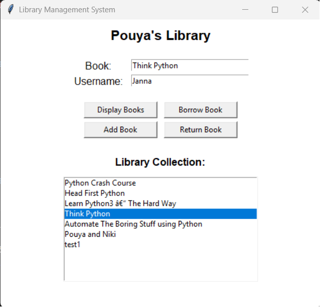
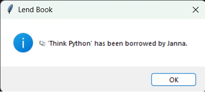
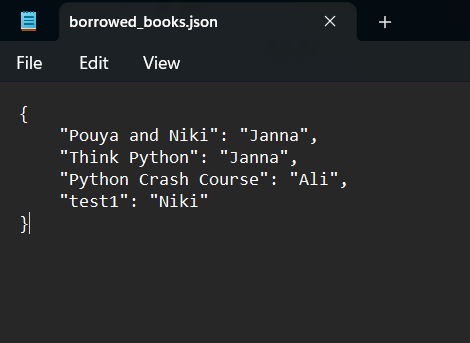

# Library Management System

## Overview

Library Management System is a desktop application built with **Python and Tkinter** that simulates the core operations of a small library. The software allows users to browse available books, borrow books, return them, and add new titles to the collection.

The system maintains a persistent record of borrowed books using JSON storage while the main book catalogue is stored in a local text database.

This project demonstrates practical usage of:

* Python object-oriented programming
* GUI development with Tkinter
* File-based data storage
* JSON data persistence
* Basic library inventory logic

The application loads the library catalogue from a local dataset file and updates borrowing records dynamically.

---

## Project Screenshots

### Application Interface



### Successful Borrow



### Borrowed Books Record



---

## Features

### Library Catalogue Management

The list of available books is stored in a local dataset file (`LibraryDataset.txt`). Each line represents one book in the library collection.

Example dataset:

```
Atomic Habits
Clean Code
The Pragmatic Programmer
Deep Learning with Python
```

The system loads this dataset during application startup and displays the catalogue in the GUI.

---

### Borrowing System

The application tracks borrowed books using a dictionary stored in JSON format.

Example structure:

```python
self.lendDict = {
    "Clean Code": "Alice",
    "Atomic Habits": "Bob"
}
```

When a user borrows a book:

* The system checks if the book exists in the catalogue
* It verifies whether the book is already borrowed
* The user name is recorded as the borrower
* The transaction is saved to a JSON file

---

### Book Return Functionality

Users can return borrowed books through the interface.

When a book is returned:

* The system removes it from the borrowed records
* The JSON storage file is updated
* The book becomes available for borrowing again

This simulates a simplified version of real-world library inventory tracking.

---

### Adding New Books

New books can be added to the library through the GUI.

When a book is added:

* The program checks if the book already exists
* If not, the book is appended to the catalogue
* The dataset file (`LibraryDataset.txt`) is updated

Example write operation:

```
with open("LibraryDataset.txt", "a") as f:
    f.write(f"\n{book}")
```

---

### Borrowing Data Persistence

Borrowed book records are stored in `borrowed_books.json`.

Example file content:

```json
{
    "Clean Code": "Alice",
    "Atomic Habits": "Bob"
}
```

This ensures that borrowing information persists even after restarting the application.

---

## GUI Implementation

The graphical interface is implemented using **Tkinter**, Python’s standard GUI toolkit.

Key interface components include:

* Labels for system information
* Entry widgets for book titles and usernames
* Buttons for library operations
* A Listbox for displaying available books

Main interface elements:

| Component            | Purpose                           |
| -------------------- | --------------------------------- |
| Book Entry           | Input book title                  |
| Username Entry       | Input borrower name               |
| Display Books Button | Show library collection           |
| Borrow Book Button   | Borrow a book                     |
| Add Book Button      | Add a new title                   |
| Return Book Button   | Return a borrowed book            |
| Listbox              | Display current library catalogue |

---

## Project Structure

```
Library-Management-System
│
├── main.py
├── LibraryDataset.txt
├── borrowed_books.json
├── images/
│   ├── library-interface.png
│   └── borrowed-books-example.png
└── README.md
```

---

## How to Run the Project

### 1. Clone the repository

```
git clone https://github.com/yourusername/Library-Management-System.git
```

### 2. Navigate to the project directory

```
cd Library-Management-System
```

### 3. Run the application

```
python main.py
```

Python 3.8 or newer is recommended.

---

## Example Workflow

1. Launch the application
2. View the available books in the catalogue
3. Enter a book title and username
4. Click **Borrow Book**
5. Borrowed record is saved to JSON
6. Users can return books using **Return Book**

---

## Technologies Used

* **Python 3**
* **Tkinter** – graphical user interface
* **JSON** – persistent storage for borrowing records
* **Text file database** – book catalogue storage
* **OS module** – file existence verification

---

## Learning Objectives

This project was developed to practice:

* Object-oriented programming in Python
* Building GUI applications with Tkinter
* Managing persistent application data
* Implementing simple inventory logic
* File handling and data validation

---

## Possible Improvements

Future enhancements could include:

* Book search functionality
* SQLite database integration
* Borrowing history tracking
* Due date and late return system
* User account management
* Improved graphical interface

---

## Author

Pouya Nasraei
Python Developer | Software Engineer
