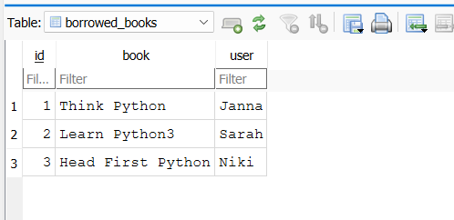

# Library Management System

## Overview

Library Management System is a desktop application built with **Python and Tkinter** that simulates the core operations of a small library. The application allows users to browse available books, borrow books, return them, and add new titles to the catalogue.

The system stores the library catalogue in a local dataset file while borrowed records are persisted in JSON format. The project was later refactored into a **modular architecture**, separating business logic, validation, and user interface layers.

This project demonstrates practical usage of:

* Python object-oriented programming
* GUI development with Tkinter
* Modular software design
* File-based data storage
* JSON persistence
* Input validation
* Unit testing with `unittest`

The application loads the library catalogue from a dataset file and dynamically manages borrowing records.

---

# Project Screenshots

### Application Interface


### Successful Borrow


### Borrowed Books Record



---

# Features

## Library Catalogue Management

The list of available books is stored in a dataset file called `LibraryDataset.txt`.

Each line in the file represents one book.

Example dataset:

```
Python Crash Course
Head First Python
Learn Python3
Think Python
Automate The Boring Stuff using Python
```

During application startup the dataset is loaded into memory and displayed in the GUI.

---

## Borrowing System

Borrowed books are stored in a dictionary and persisted as a JSON file.

Example structure:

```python
self.lendDict = {
    "Think Python": "Janna",
    "Head First Python": "Niki"
    "Learn Python3": "Sarah"
}
```

When a user borrows a book the system:

1. Validates the input
2. Checks if the book exists
3. Verifies that it is not already borrowed
4. Saves the borrowing record to JSON storage

---

## Returning Books

Users can return books through the graphical interface.

When a book is returned:

* The system removes the record from the borrowing dictionary
* The JSON storage file is updated
* The book becomes available again

This simulates simplified real-world inventory tracking.

---

## Adding New Books

Users can add new titles directly through the interface.

When adding a book:

* The system validates the title
* It checks if the book already exists
* The new title is appended to the dataset file

Example operation:

```
with open("LibraryDataset.txt", "a") as f:
    f.write(f"\n{book}")
```

---

## Input Validation

The project includes a **validation layer** to prevent invalid inputs.

Examples of validation rules:

* Book titles cannot be empty
* Usernames cannot be empty
* Minimum character length checks

This prevents errors such as:

```
book = ""
user = ""
```

Validation is implemented in a dedicated module to keep the system modular and maintainable.

---

# GUI Implementation

The graphical interface is built using **Tkinter**, Python’s standard GUI toolkit.

Key interface components include:

| Component            | Purpose                   |
| -------------------- | ------------------------- |
| Book Entry           | Input book title          |
| Username Entry       | Input borrower name       |
| Display Books Button | Show catalogue            |
| Borrow Book Button   | Borrow a book             |
| Add Book Button      | Add new title             |
| Return Book Button   | Return a borrowed book    |
| Listbox              | Display library catalogue |

The GUI communicates with the **Library class**, which handles all business logic.

---

# Project Architecture

The project was refactored into a modular structure to improve maintainability and scalability.

```
Library-Management-System
│
├── main.py                 # Application entry point
├── gui.py                  # Tkinter interface
├── library.py              # Core library logic
├── validation.py           # Input validation
│
├── LibraryDataset.txt      # Book catalogue
├── borrowed_books.db       # SQLite database storing borrowed books
├── requirements.txt        # Project dependency list
│
├── test_library.py         # Unit tests
│
├── Images
│   ├── App-Interface.png
│   ├── Successful-Borrow.png
│   └── Borrowed-Books-Json.png
│
└── README.md
```

This architecture separates:

* **Presentation layer** → GUI
* **Business logic** → Library class
* **Validation layer** → Input checks
* **Testing layer** → Automated tests

This structure mirrors common real-world Python application design.

---

# Running the Project

## 1. Clone the repository

```
git clone https://github.com/yourusername/Library-Management-System.git
```

## 2. Navigate to the project folder

```
cd Library-Management-System
```

## 3. Run the application

```
python main.py
```

Python **3.8+** is recommended.

---

# Running the Tests

Unit tests verify the functionality of the core library logic.

Run tests using:

```
python -m unittest
```

Example test coverage includes:

* Adding new books
* Preventing duplicate entries
* Borrowing logic validation

---

# Example Workflow

1. Launch the application
2. View the library catalogue
3. Enter a book title and username
4. Click **Borrow Book**
5. Borrow record is saved to JSON
6. Users can return books using **Return Book**

---

# Technologies Used

* **Python 3**
* **Tkinter** – GUI framework
* **JSON** – persistent borrowing records
* **Text file storage** – library catalogue
* **unittest** – automated testing
* **OS module** – file operations

---

# Learning Objectives

This project demonstrates practical skills in:

* Python object-oriented programming
* Modular software design
* GUI application development
* File handling and persistence
* Input validation
* Unit testing

---

# Possible Improvements

Future enhancements could include:

* SQLite database integration
* Book search functionality
* Borrowing history tracking
* Due dates and late return notifications
* User account system
* Improved GUI styling

---

# Author

Pouya Nasraei
Python Developer | Software Engineer
